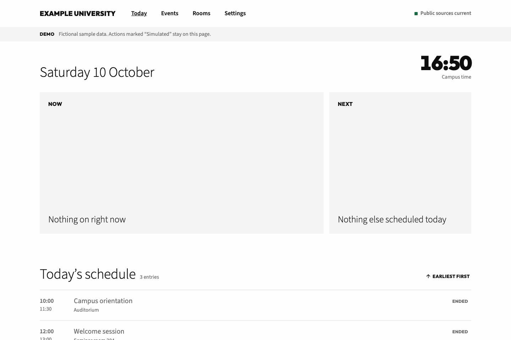
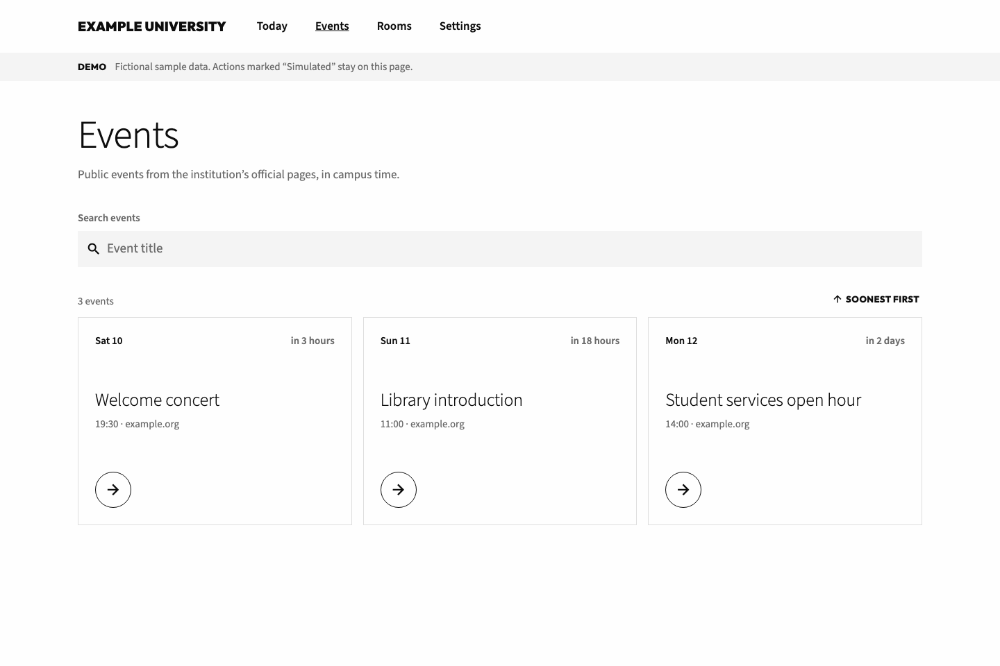
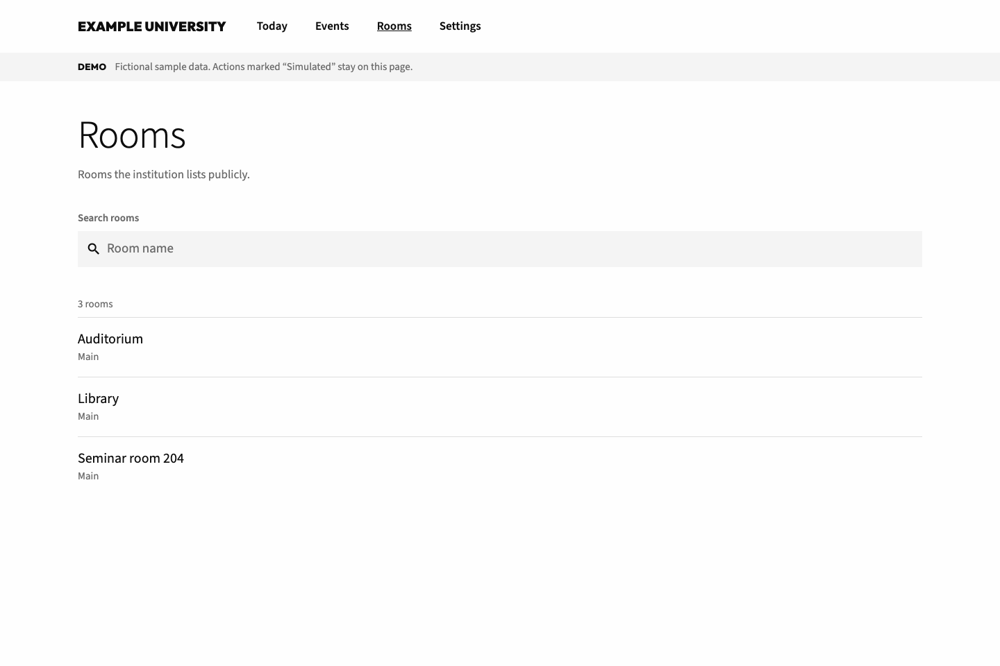
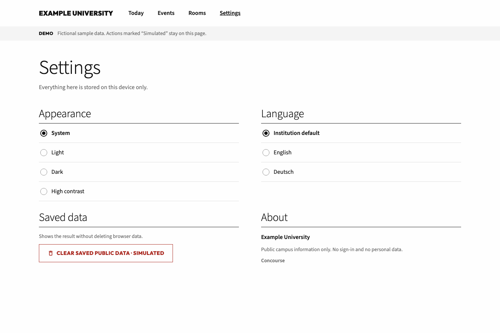
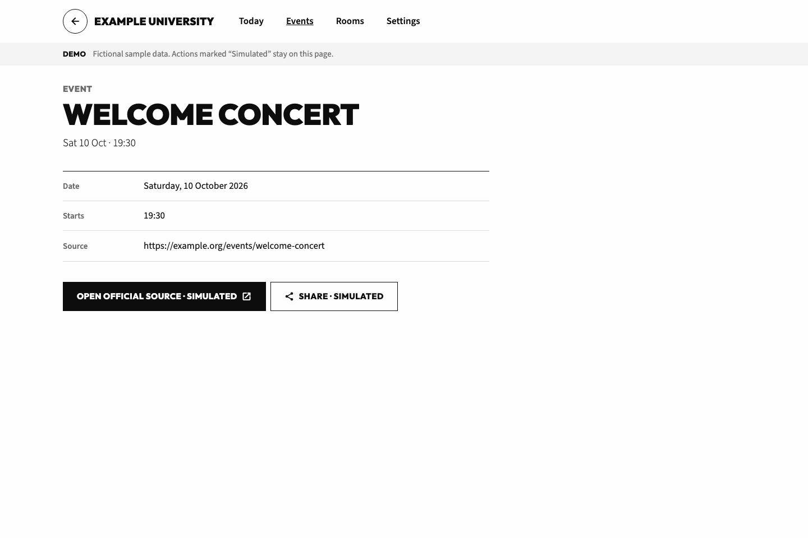
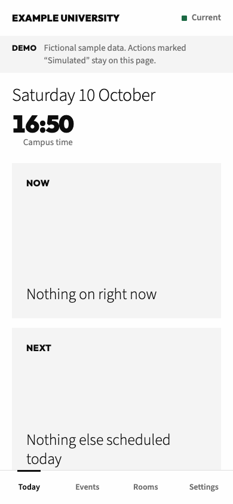

# Concourse Campus Kit

Public university events, calendars, and rooms in one campus app.

Concourse turns a university's public events pages, calendar feeds, and room
lists into one calm, accessible campus app: a Node.js backend-for-frontend (BFF)
and an Expo Router client for iOS, Android, and the web.

This repository is an alpha source candidate. A checkout is not a published
release, a hosted API, or a signed store build.

[Open the static demo](https://sebastianspicker.github.io/concourse-campus-kit/) ·
[Browse the design preview](https://sebastianspicker.github.io/concourse-campus-kit/design-preview/) ·
[Read the architecture](docs/architecture.md)

Both demos use the fictional `example` institution pack and local fixtures. They
never call the API, campus services, or the network, so you can explore them
offline.

## Screenshot tour

These screenshots come from the real client in the static demo.

| Today | Events |
|---|---|
|  |  |

| Rooms | Settings |
|---|---|
|  |  |

| Event detail | On a phone |
|---|---|
|  |  |

After a UI change, regenerate the tour with `pnpm capture:screenshots`. It
expects the demo served at <http://127.0.0.1:8082/concourse-campus-kit/>; the
[runbook](docs/runbook.md) has the details.

## What it does

The client offers Today, Events, Rooms, Schedule, Settings, and detail views.
The API normalizes public HTTP(S) event pages, public ICS feeds, and
pack-defined rooms. Every response is validated against a shared schema, and the
client always tells the user whether its data is current, cached, degraded,
offline, empty, unavailable, or error.

Some things are deliberately out of scope: protected connectors, SSO and user
accounts, personal schedules, occupancy, credentials, hosted infrastructure, EAS
project linkage, signing, and store submission. Anything on that list needs a
separate, reviewed implementation.

## Components

| Path | Purpose | Boundary | Documentation |
|---|---|---|---|
| `packages/contracts` | Zod wire schemas, routes, headers, query types, and API error shape | Private workspace library built before consumers | [Contract guide](packages/contracts/README.md) |
| `packages/institutions` | Public pack schema, branding, bundled packs, and registry | Private workspace library built before the applications | [Institution packs](docs/institutions.md) |
| `apps/api` | Public-data BFF, source adapters, cache, and HTTP security controls | Independently run Node.js service and release container | [API guide](apps/api/README.md) |
| `apps/client` | Expo Router application, design system, transport, and persisted cache | Independently run native/web application; owner-managed EAS builds | [Client guide](apps/client/README.md) |
| `infra`, `scripts` | Development container, setup, verification, demo, and release tooling | Repository support tooling | [Runbook](docs/runbook.md) |

The client only ever talks to the BFF over HTTP; it never imports API source.
The full dependency graph lives in [Architecture](docs/architecture.md).

## Requirements

- Node.js 22.13 or newer; CI uses the exact version in [.nvmrc](.nvmrc).
- Corepack and pnpm 9.15.0.
- Expo Go, or an institution-owned compatible development client for device work.
- Docker only for container workflows.

## Setup and local run

From the repository root:

~~~bash
corepack pnpm@9.15.0 install --frozen-lockfile
test -e apps/api/.env || cp apps/api/.env.example apps/api/.env
test -e apps/client/.env || cp apps/client/.env.example apps/client/.env
~~~

`pnpm setup:dev` does all of that for you: it installs, creates only the missing
`.env` files, then builds and type-checks the workspace.

Set the same `INSTITUTION_ID` for the API and client, and point
`EXPO_PUBLIC_BFF_BASE_URL` in `apps/client/.env` at an API URL the target
browser, simulator, emulator, or device can reach. Then start each side in its
own terminal:

~~~bash
INSTITUTION_ID=example pnpm --filter @concourse/api dev
INSTITUTION_ID=example pnpm --filter @concourse/client start
~~~

Use `pnpm --filter @concourse/client dev` only with a compatible development
client. On a physical device, expose the API over HTTPS or a locally trusted
HTTPS proxy instead of a loopback URL.

The API serves `GET /health`, `/events`, `/rooms`, `/schedule`, and `/today`.
Configuration, query behavior, response states, and troubleshooting are all in
the [runbook](docs/runbook.md).

## Common commands

Run these from the repository root.

| Command | Purpose |
|---|---|
| `pnpm dev` | Run workspace development tasks in parallel; the client path needs a development client |
| `pnpm lint` | Run root and workspace ESLint checks |
| `pnpm check:architecture` | Test and enforce workspace and source-layer boundaries |
| `pnpm typecheck` | Type-check root tooling and all workspaces |
| `pnpm test` | Run all workspace Vitest suites |
| `pnpm build` | Build workspaces in dependency order with fresh output |
| `pnpm release:check` | Validate versions, Expo identity, and changelog metadata |
| `pnpm verify` | Run the complete local source-candidate gate |

There is no formatter command, and ESLint does not lint Markdown. `pnpm verify`
is local source evidence only: it does not prove a deployment, public-source
reachability, an EAS build, a signed artifact, device behavior, or remote
security checks.

## Static demo

~~~bash
pnpm build:demo
pnpm verify:demo:artifact
PORT=8082 node scripts/serve-pages-output.mjs dist-pages
~~~

Then open <http://127.0.0.1:8082/concourse-campus-kit/>. Rebuild `dist-pages/` before you
treat it as evidence; generated output is not a source file.

To regenerate the README screenshots, leave that server running and run:

~~~bash
pnpm capture:screenshots
~~~

## Documentation

- [Architecture](docs/architecture.md)
- [Runbook and configuration](docs/runbook.md)
- [Public sources](docs/connectors.md)
- [Product scope](PRODUCT.md), [client conventions](docs/frontend.md), and
  [design reference](DESIGN.md)
- [CI](docs/ci.md), [API deployment](docs/deploy/bff.md),
  [client deployment](docs/deploy/mobile.md), and
  [release process](docs/release.md)
- [Contributing](CONTRIBUTING.md), [support](SUPPORT.md), and
  [security reporting](SECURITY.md)

Concourse is licensed under the [MIT License](LICENSE).
